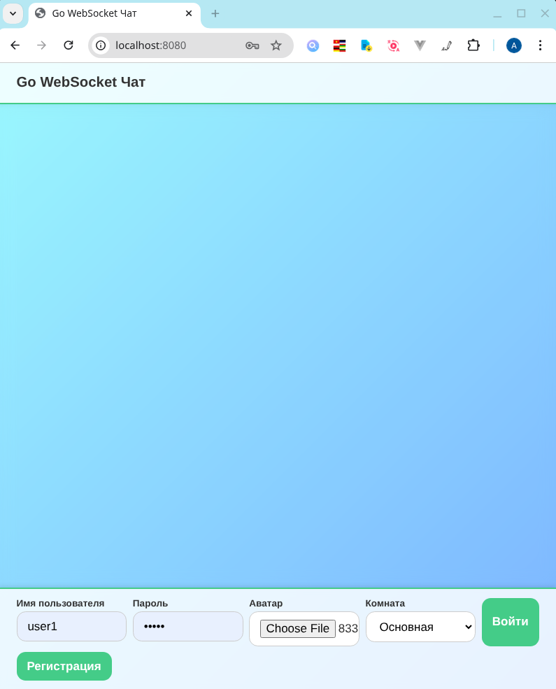
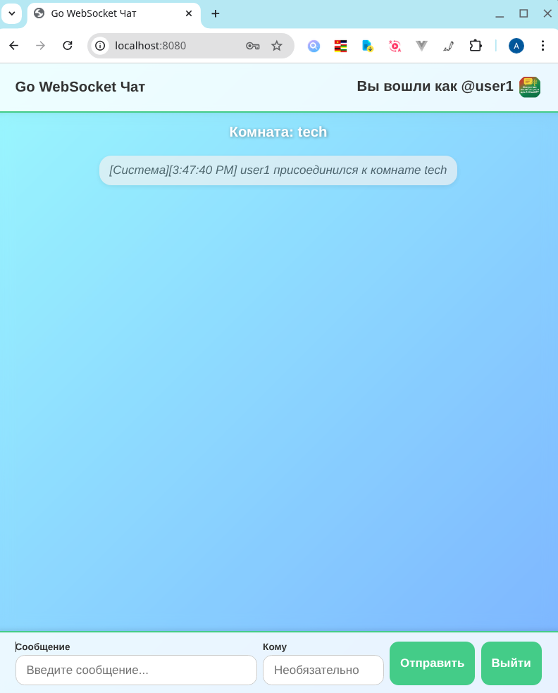
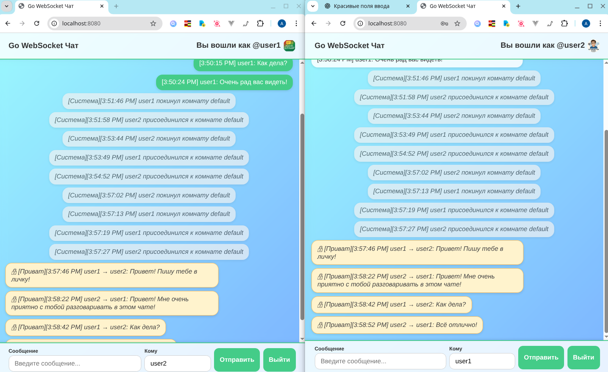
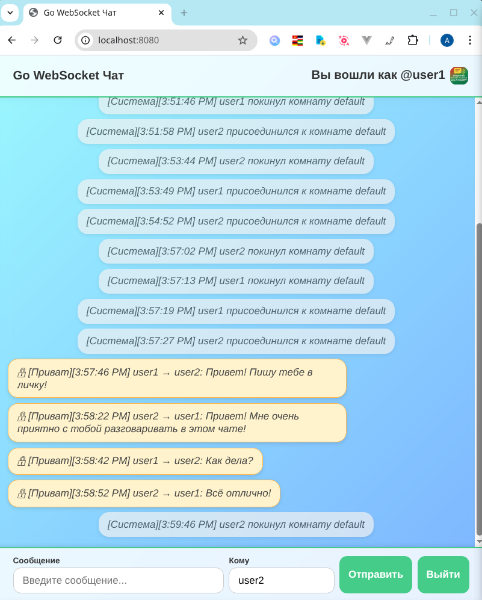

# Go WebSocket Чат

## 📌 Краткое описание проекта

**websocket-chat** — это онлайн-чат с авторизацией, реализованный на Go с использованием WebSocket.  
Проект позволяет пользователям общаться в реальном времени, обеспечивая быстрый обмен сообщениями и безопасность с помощью JWT-авторизации.

## 📸 Скриншоты

### 1. Авторизация


### 2. Вход в чат


### 3. Интерфейс чата


### 5. Приватное сообщение


### 6. Выход


## 🚀 Основные возможности

- **WebSocket-чат** — обмен сообщениями между пользователями в реальном времени.  
- **Регистрация и логин** с JWT-токеном и cookie-авторизацией.  
- **Поддержка приватных и публичных сообщений** — можно отправлять сообщения как в общий чат, так и конкретному пользователю.  
- **История сообщений** (последние 50 сообщений) сохраняется в памяти.  
- **Тесты** — unit- и integration-тесты для ключевых компонентов.  
- **CI/CD через GitHub Actions** — автоматическая проверка, тестирование и сборка проекта.  

---

## 🛠️ Технологии

| Компонент       | Технология / Библиотека                |
|-----------------|-----------------------------------------|
|🐹 Язык            | Go                                      |
|🌐 WebSocket       | [`gorilla/websocket`](https://github.com/gorilla/websocket) |
|🔑 JWT-авторизация | [`golang-jwt/jwt/v5`](https://github.com/golang-jwt/jwt) |
| Тестирование    | `testing`, `httptest`, `testify/assert` |
| CI/CD           | GitHub Actions                          |

---

## ⚙️ Установка и запуск

1. **Клонируйте репозиторий:**
   ```bash
   git clone https://github.com/go-portfolio/websocket-chat.git
   cd websocket-chat
2. Установите зависимости:
```
go mod download
```
3. Запустите приложение:

```bash
go run cmd/server/main.go
```
4. По умолчанию сервер стартует на http://localhost:8080.

## 💻 Использование
Откройте браузер и перейдите на http://localhost:8080.

Зарегистрируйтесь через форму (поддерживается загрузка аватара через multipart/form-data).

После регистрации выполните вход — JWT будет автоматически сохранён в cookie.

Подключитесь к WebSocket:

``` bash
ws://localhost:8080/ws?room=default
```
(или укажите любую другую комнату).

Отправляйте сообщения в формате:

```json
{ "type": "message", "text": "Привет, мир!" }
```
или для приватного сообщения:

```json
{ "type": "private", "text": "Секретное сообщение", "to": "username" }
```
Получайте сообщения и системные уведомления в реальном времени.

## ✅ Тестирование
Запуск всех тестов:

```bash
go test -v ./...
```
Также настроен GitHub Actions:
при каждом пуше выполняются сборка, тесты и линтинг.

## 📂 Структура проекта
```tree
├── cmd
│   └── server
│       └── main.go             Точка входа приложения
├── config                    
│   └── config.go               
├── internal
│   ├── app
│   │   └── app.go
│   ├── auth                   # JWT-утилиты
│   │   ├── jwt.go
│   │   └── secret.go
│   ├── chat                   # Логика чата (Hub, Room, Client)
│   │   ├── client.go
│   │   ├── hub.go
│   │   ├── room.go
│   │   ├── types.go
│   │   └── unit
│   │       └── chat_test.go
│   ├── user                   # Пользователи и авторизация
│   │   ├── auth.go
│   │   ├── credentials.go
│   │   ├── store.go
│   │   └── unit
│   │       └── user_test.go
│   └── web                    # HTTP-хендлеры и WebSocket-сервер
│       ├── handlers.go
│       ├── middleware.go
│       ├── utils.go
│       ├── websocket.go
│       └── unit
│           └── web_test.go
├── migrations                 # SQL-миграции
│   ├── 001_init.up.sql
│   └── 001_init.down.sql
├── uploads                    # Хранилище загруженных файлов (аватаров)
├── go.mod
├── go.sum
├── Makefile
└── README.md
```
## Установка миграций

Для работы с миграциями в этом проекте используется [golang-migrate](https://github.com/golang-migrate/migrate).  
Рекомендуется установить CLI глобально через Go:

```bash
go install github.com/golang-migrate/migrate/v4/cmd/migrate@latest
```
После установки убедитесь, что `$GOPATH/bin` или `~/go/bin` добавлен в ваш `PATH`, чтобы команда migrate была доступна в терминале:
```bash
migrate -version
```
Если версия отображается, CLI установлен и готов к использованию.

Запуск миграций
Применить все миграции:
```bash
make migrate-up
```
Откатить последнюю миграцию:
```bash
make migrate-down
```
## 📜 Лицензия
Проект распространяется под лицензией MIT.
Pull-requests и предложения приветствуются 🚀

